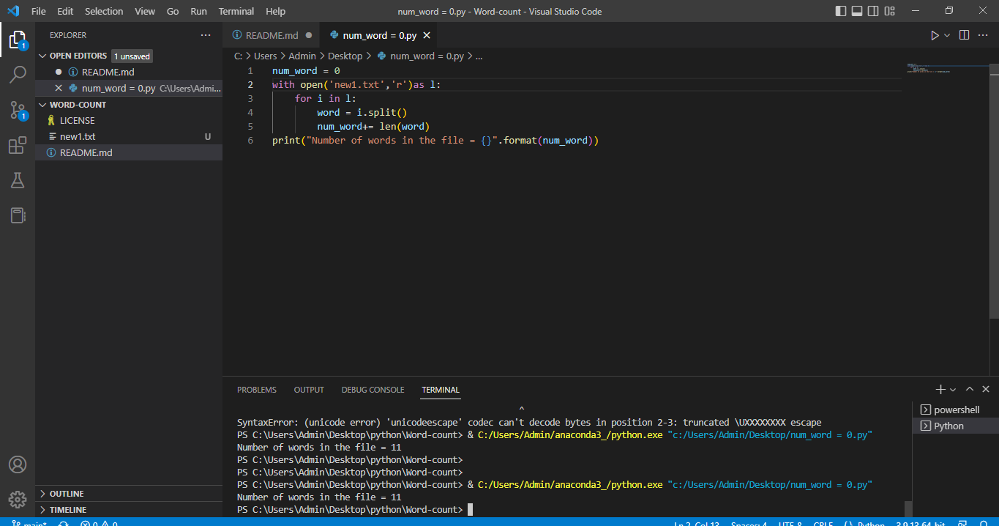

# Word-count
## AIM:
To write a python program for getting the word count from a text.
## EQUIPEMENT'S REQUIRED: 
PC
Anaconda - Python 3.7
## ALGORITHM: 
### Step 1:
Create a file and add some content into it.
### Step 2: 
 Open file using with keyword/built-in function in read mode.
### Step 3: 
Use read() to read the contents of the file.
### Step 4:  
Split the lines using split().
### Step 5: 
Iterate the list and increment the count
### Step 6: 
Print the output
## PROGRAM:
```
# Name : Manoj S
# Ref no : 22009066
num_word = 0
with open('new1.txt','r')as l:
    for i in l:
        word = i.split()
        num_word+= len(word) 
print("Number of words in the file = {}".format(num_word))        
```
### OUTPUT:



## RESULT:
Thus the program is written to find the word count from a text.
